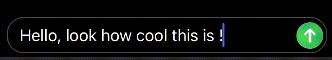
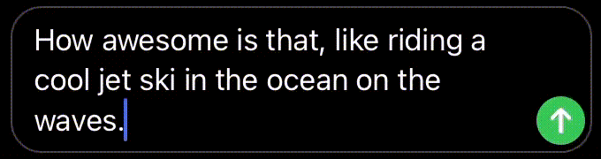
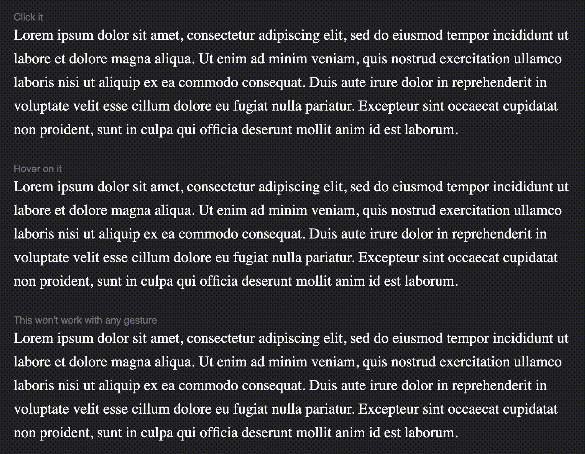

# **imta**

#### Short for _iMessage Text Animation_ 💬

This will animate the text like apple does in iMessages.
Woohooooo!

Apple iMessages have some cool animation for text

like these.

So I thought of making it happen in html (css & js too ofc.)

I've came a this far -

And there's a long way to go!

Currently using [AnimeJS](https://animejs.com/) as the animation engine.
